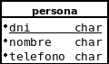
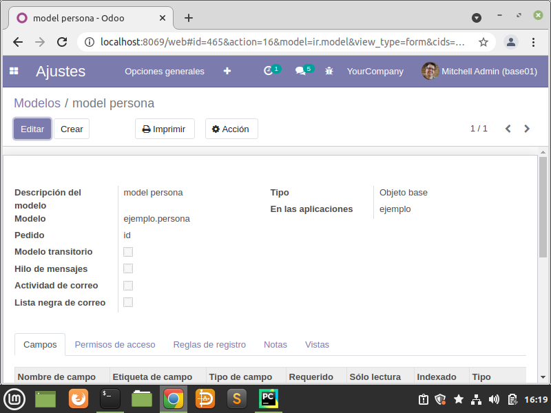
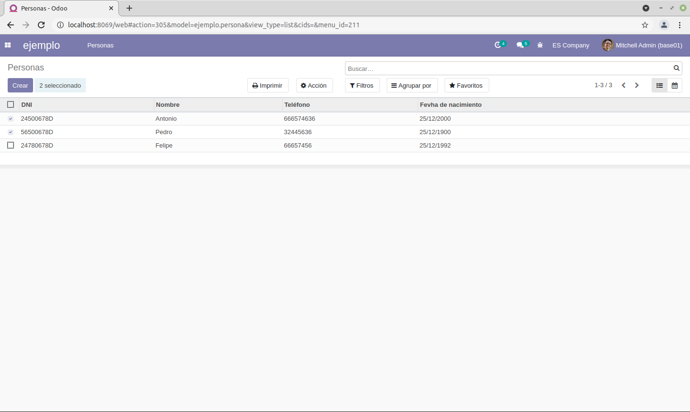

## Ejemplo básico odoo 14

### Creación de un módulo básico en Odoo 14.

En la carpeta instalacionodoo se encuentra un script para instalarlo en Linux.

Nos posicionamos en /opt/osoo/odoo y ejecutamos

~~~~
sudo ./odoo-bin scaffold ejemplo ./addons/
~~~~

Siendo ejemplo el nombre del módulo. 

### Creación de un modelo.
Crearemos el siguiente modelo:

 En models/models.py añadimos la definición del nuevo modelo:
~~~~

from odoo import models, fields, api

class persona(models.Model):
	_name = 'ejemplo.persona'
	_description = 'model persona'

	name = fields.Char('DNI',required=True)
	nombre = fields.Char(string='Nombre',required=True)
	telefono = fields.Char(string='Teléfono',required=True)
~~~~

name es el nombre del campo que se utilizará como índice, siempre se debe llamar así.
Ahora vamos a comprobar el funcionamiento del modelo creado.
Cada vez que se modifique un fichero python, deberemos reiniciar Odoo.

~~~~
Para ver el fichero log de Odoo:
tail -f /var/log/odoo/odoo-server.log

Reiniciar:
sudo /etc/init.d/odoo restart 
~~~~

Activamos modo desarrollador:

Ajustes -> Herramientas de desarrollador -> Activar el modo de desarrollador

Actualizamos la lista de aplicaciones:

Aplicaciones -> Actualizar lista de aplicaciones

Buscamos nuestro módulo y los instalamos. Una vez instalado el módulo, iremos a:
Ajustes -> Técnico -> Estructura de la base de datos -> modelos, si todo funciona correctamente, estará nuestro modelo (ejemplo.persona) con los campos creados 
también tendrá otros campos internos de Odoo.

###Creación de vistas
Añadimos al fichero views/views.xml:
~~~~

    <!-- Vistas de persona-->

    <record model="ir.ui.view" id="ejemplo.persona_list_view">
      <field name="name">ejemplo.persona.view.tree</field>
      <field name="model">ejemplo.persona</field>
      <field name="arch" type="xml">
        <tree>
          <field name="name"/>
          <field name="nombre"/>
          <field name="telefono"/>
          <field name="fecha_nacimiento"/>
        </tree>
      </field>
    </record>

<!-- search -->

    <record model="ir.ui.view" id="ejemplo.persona_search_view">
      <field name="name">ejemplo.persona.view.search</field>
      <field name="model">ejemplo.persona</field>
      <field name="arch" type="xml">
        <search>
          <field name="name"/>
          <field name="nombre"/>
          <field name="telefono"/>
          <group>
            <filter name="group_by_nombre" string="nombre" context="{'gropup_by':'nombre'}" />
          </group>
        </search>
      </field>
    </record>

    
    <!-- form -->
    
    <record model="ir.ui.view" id="ejemplo.persona_form_view">
      <field name="name">ejemplo.persona.view.form</field>
      <field name="model">ejemplo.persona</field>
      <field name="arch" type="xml">
        <form string="Información persona">
          <sheet>
            

              <h1>
                DNI <field name="name" placeholder="dni"/>
              </h1>
            

            <group>
              <group>
                <separator string="Datos"/>
                <field name="nombre" placeholder="nombre"/>
                <field name="telefono"/>
                <field name="fecha_nacimiento"/>
              </group>
            </group>
          </sheet>
        </form>
      </field>

    </record>

<!-- calendar -->

    <record model="ir.ui.view" id="ejemplo.persona_calendar_view">
      <field name="name">ejemplo.persona.view.calendar</field>
      <field name="model">ejemplo.persona</field>
      <field name="arch" type="xml">
        <calendar string="Fecha de nacimiento" date_start="fecha_nacimiento" color="nombre" mode="month">
          <field name="name"/>
          <field name="nombre"/>
          <field name="telefono"/>
        </calendar>
      </field>
    </record>

    <!-- Definición de menús-->

    <!-- actions opening views on models -->

    <record model="ir.actions.act_window" id="ejemplo.persona_action_window">
      <field name="name">Personas</field>
      <field name="res_model">ejemplo.persona</field>
      <field name="view_mode">tree,form,calendar</field>
    </record>

    <menuitem name="ejemplo" id="ejemplo.menu_root"/>
    <menuitem name="Personas" id="ejemplo.menu_persona" parent="ejemplo.menu_root"/>
    <menuitem name="List" id="ejemplo.menu_persona_list" parent="ejemplo.menu_persona"
              action="ejemplo.persona_action_window"/>

~~~~

Debido a los modelos de seguridad, no nos aparece el menú de nuestro módulo, este problema lo solucionaremos más adelante, 
para poder visualizarlo deberemos ser superusuarios (icono bug-> convertirse en superusuario), ya si nos aparecerá nuestro módulo.

### Modelos de seguridad

Creamos el fichero security/ejemplo_security.xml, en este archivo, definiremos dos grupos(usuario, administrador), en este último, tendrá también 
los permisos del grupo usuario (además de los suyos): 
~~~~

                <field name="implied_ids" eval="[(4, ref('group_ejemplo_usuario'))]"/>
~~~~
Añadimos a los usuarios administradores de odoo 
~~~~
                <field name="users" eval="[(4, ref('base.user_root')), (4, ref('base.user_admin'))]" />
~~~~
De esta forma podrán acceder al módulo sin necesidad de ser superusuario. El contenido del fichero es:
~~~~
<?xml version="1.0" encoding="utf-8" ?>
    <odoo>
        <data>
            <!-- Definimos una categoría de seguridad para módulo-->
            <record model="ir.module.category" id="ejemplo.module_category_ejemplo">
                <field name="name">Ejemplo</field>
                <field name="description">Ayuda a gestionar personas</field>
                <field name="sequence">100</field>
            </record>

            <record model="res.groups" id="group_ejemplo_usuario">
                <field name="name">Usuario</field>
                <field name="category_id" ref="ejemplo.module_category_ejemplo"></field>
                <field name="comment"> Usuarios solo pueden leer</field>
            </record>

            <record model="res.groups" id="group_ejemplo_administrador">
                <field name="name">Administrador</field>
                <field name="category_id" ref="ejemplo.module_category_ejemplo"></field>
                <field name="comment"> Administrador pueden leer y escribir</field>
                <!-- tambien pertenecen al grupo usuario, mirar documentación ORM-->
                <field name="implied_ids" eval="[(4, ref('group_ejemplo_usuario'))]"/>
                 <!--Añadimos a los usuarios administradores de odoo -->
                <field name="users" eval="[(4, ref('base.user_root')), (4, ref('base.user_admin'))]" />
            </record>
        </data>
    </odoo>
~~~~
Al fichero security/ir.model.access.csv se cambiará su contenido por
~~~~
id,name,model_id:id,group_id:id,perm_read,perm_write,perm_create,perm_unlink
access_ejemplo_persona_usuario,ejemplo.persona.usuario,model_ejemplo_persona,ejemplo.group_ejemplo_usuario,1,0,0,0
access_ejemplo_persona_administrador,ejemplo.persona.administrador,model_ejemplo_persona,ejemplo.group_ejemplo_administrador,1,1,1,1_
~~~~

Por último, en __manifest__.py indicaremos la utilización de estos archivos:
~~~~
........................
 'data': [
        'security/ejemplo_security.xml',
        'security/ir.model.access.csv',
 .......................       
~~~~

Actualizaremos la aplicación, y podremos entrar como administrador, también, si creamos un usuario y le asignamos 
uno de los grupos, éste tendrá acceso. Para poder comprobar el correcto funcionamiento,
en Ajustes->usuarios y compañías -> grupos , estarán los grupos creados, también podremos crear nuevos usuarios y añadirlos a estos grupos.

### Creación del icono de la aplicación. 

Crearemos la carpeta static/description , en esta capeta copiaremos el icono (140x140 png). en el fichero views/views.xml, añadiremos a la etiqueta:
~~~~

    <menuitem name="ejemplo" id="ejemplo.menu_root" "/>
    web_icon="ejercicio,static/description/icon.png
    
    Quedando así:
    <menuitem name="ejemplo" id="ejemplo.menu_root" web_icon="ejercicio,static/description/icon.png">
~~~~

Al actualizar la aplicación, el icono aparecerá.

### Realización de informes.

Creamos la carpeta report, dentro de ella el archivo ejemplo_persona_report.xml con el contenido:
~~~~
<odoo>
    <record id="ejemplo.persona_report" model="ir.actions.report">
        <field name="name"> Informe de personas</field>
        <field name="model">ejemplo.persona</field>
        <field name="report_type">qweb-pdf</field>
        <field name="report_name">ejemplo.persona_report_view</field>
        <field name="report_file">ejemplo.persona_report</field>
        <field name="binding_model_id" ref="model_ejemplo_persona"/>
        <field name="binding_type">report</field>

    </record>

    <template id="persona_report_view">
        <t t-call="web.html_container">
            <!-- muestra datos de la empresa (salta página) -->
            <t t-call="web.external_layout">
                <h1>Personas </h1> 
                <t t-foreach="docs" t-as="persona">
                    <ul>
                        <li>    dni </li>
                        <li>    nombre </li>
                        <li>    teléfono </li>

                    </ul>
                </t>
            </t>
        </t>
    </template>

</odoo>
~~~~

Tenemos que informar a Odoo del la existencia de este fichero, por lo tanto,
en __manifest__.py  data añadimos 'report/ejemplo_persona_report.xml', . Actualizaremos el módulo, al 
marcar uno o varios registros, nos dará la opción de imprimir, generando un pdf.

### Datos demo.

Odoo tiene la opción (a la hora de la creación de la base de datos), 
de instalar el módulo con unos datos de demostración, 
esto es útil, a la hora de probar el funcionamiento de un módulo.

Editaremos el fichero demo/demo.xml, aquí crearemos todos los registro que necesitemos:
~~~~
<odoo>
    <data>

          <record id="object0" model="ejemplo.persona">
            <field name="name">24500678D</field>
            <field name="nombre">Antonio</field>
            <field name="fecha_nacimiento">2000-12-25</field>
            <field name="telefono">666574636</field>
          </record>

        <record id="object1" model="ejemplo.persona">
            <field name="name">56500678D</field>
            <field name="nombre">Pedro</field>
            <field name="fecha_nacimiento">1900-12-25</field>
            <field name="telefono">32445636</field>
          </record>

        <record id="object2" model="ejemplo.persona">
            <field name="name">24780678D</field>
            <field name="nombre">Felipe</field>
            <field name="fecha_nacimiento">1992-12-25</field>
            <field name="telefono">66657456</field>
          </record>

    </data> 
</odoo>
~~~~

En este caso, para comprobar el funcionamiento, debemos desinstalar el módulo y volver a instalarlo, solo 
se cargan los datos en la instalación, si actualizamos, los datos demo no se introducirán en la base de
 datos. Los datos solo se cargarán si se seleccionó la 
opción demo en la pantalla de creación de la base de datos.

