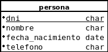

## Ejemplo básico odoo 14

###Creación de un módulo basico en Odoo 14.
En la carpeta instalacionodoo se  encuentra un script para instalarlo en Linux.

Nos posicionamos en /opt/osoo/odoo y ejecutamos

~~~~
sudo ./odoo-bin scaffold ejemplo ./addons/
~~~~

Siendo ejemplo el nombre del módulo. 

### Creación de un modelo.
Crearemos el siguiente modelo:

 En models/models.py añadimos la defininón del nuevo modelo:
~~~~

from odoo import models, fields, api

class persona(models.Model):
	_name = 'ejemplo.persona'
	_description = 'model persona'

	name = fields.Char('DNI',required=True)
	nombre = fields.Char(string='Nombre',required=True)
	telefono = fields.Char(string='Teléfono',required=True)
~~~~

name es el nombre del campo que se utilizará como índice, siempre se debe llamar así.
Ahora vamos a comprobar el funcionamiento del modelo creado.
Cada vez que se modifique un fichero python, deberemos reiniar Odoo.

~~~~
Para ver el fichero log de Odoo:
tail -f /var/log/odoo/odoo-server.log

Reiniciar:
sudo /etc/init.d/odoo restart 
~~~~

Activamos modo desarrollador:

Ajustes -> Herramientas de desarrollador -> Activar el modo de desarrollador

Actualizamos la lista de aplicaciones:

Aplicaciones -> Actualizar lista de aplicaciones

Buscamos nuestro módulo y los instalamos. Una vez instalado el módulo, iremos a:
Ajustes -> Técnico -> Estructura de la base de datos -> modelos, si todo funciona correctamente, estará nuestro modelo (ejemplo.persona) con los campos creados 
tamnién tendrá otros campos internos de Odoo.

###Creación de vistas

